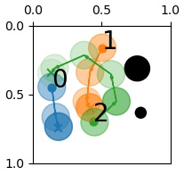

# CTRMs: Learning to Construct Cooperative Timed Roadmaps for Multi-agent Path Planning in Continuous Spaces

This is a repository for the following paper:

- Keisuke Okumura, Ryo Yonetani, Mai Nishimura, Asako Kanezaki, "CTRMs: Learning to Construct Cooperative Timed Roadmaps for Multi-agent Path Planning in Continuous Spaces," AAMAS, 2022 [[paper](https://arxiv.org/abs/2201.09467)] [[project page](https://omron-sinicx.github.io/ctrm/)]


You need [docker (≥v19)](https://www.docker.com/) and [docker-compose (≥v1.29)](https://docs.docker.com/compose/) to implement this repo.

## Demo


(generated by `./notebooks/gif.ipynb`)

## Getting Started

We explain the minimum structure. To reproduce the experiments, see [here](https://github.com/omron-sinicx/ctrm/wiki).
The link also includes training data, benchmark instances, and trained models.

### Step 1. Create Environment via Docker
- locally build docker image

```sh
docker-compose build        # required time: around 30min~1h
```

- run/enter image as a container

```sh
docker-compose up -d dev
docker-compose exec dev bash
```

- `./.docker-compose.yaml` also includes an example (dev-gpu) when [NVIDIA Docker](https://github.com/NVIDIA/nvidia-docker) is available.
- The image is based on [pytorch/pytorch:1.8.1-cuda10.2-cudnn7-devel](https://hub.docker.com/layers/pytorch/pytorch/1.8.1-cuda10.2-cudnn7-devel/images/sha256-0bb33b2f69f2af64e1c572294e3228fa423019a17aaf9bb9428e143307f307e4?context=explore) and installs [CMake](https://cmake.org/), [OMPL](https://ompl.kavrakilab.org/), etc. Please check `./Dockerfile`.
- The initial setting mounts `$PWD/../ctrm_data:/data` to store generated demonstrations, models, and evaluation results. So, a new directory (ctrm_data) will be generated automatically next to the root directory.

### Step 2. Play with CTRMs

We prepared the minimum example with Jupyter Lab.
First, startup your Jupyter Lab:

```sh
jupyter lab --allow-root --ip=0.0.0.0
```

Then, access `http://localhost:8888` via your browser and open `./notebooks/CTRM_demo.ipynb`.
The required token will appear at your terminal.
You can see multi-agent path planning enhanced by CTRMs in an instance with 20-30 agents and a few obstacles.

In what follows, we explain how to generate new data, perform training, and evaluate the learned model.

### Step 3. Data Generation

The following script generates MAPP demonstrations (instances and solutions).

```sh
cd /workspace/scripts
python create_data.py
```

You now have data in `/data/demonstrations/xxxx-xx-xx_xx-xx-xx/` (in docker env), like the below.




The script uses [hydra](https://hydra.cc/).
You can create another data, e.g., with Conflict-based Search [1] (default: prioritized planning [2]).

```sh
python create_data.py planner=cbs
```

You can find details and explanations for all parameters with:
```sh
python create_data.py --help
```

### Step 4. Model Training

```sh
python train.py datadir=/data/demonstrations/xxxx-xx-xx_xx-xx-xx
```

The trained model will be saved in `/data/models/yyyy-yy-yy_yy-yy-yy` (in docker env).

### Step 5. Evaluation

```sh
python eval.py \
insdir=/data/demonstrations/xxxx-xx-xx_xx-xx-xx/test \
roadmap=ctrm \
roadmap.pred_basename=/data/models/yyyy-yy-yy_yy-yy-yy/best
```

The result will be saved in `/data/exp/zzzz-zz-zz_zz-zz-zz`.

Probably, the planning in all instances will fail.
To obtain successful results, we need more data and more training than the default parameters as presented here.
Such examples are shown [here](https://github.com/omron-sinicx/ctrm/wiki) (experimental settings).

## Notes

- Analysis of the experiments are available in `/workspace/notebooks` (as Jupyter Notebooks).
- `./tests` uses [pytest](https://docs.pytest.org/).
  Note that it is not comprehensive, rather it was used for the early phase of development.

### Documents

A document for the console library is available, which is made by [Sphinx](https://www.sphinx-doc.org/en/master/).

-  create docs

```sh
cd docs; make html
```

- To rebuild docs, perform the following before the above.

```sh
sphinx-apidoc -e -f -o ./docs ./src
```

### Known Issues

 - Do not set `format_input.fov_encoder.map_size` larger than 250. We are aware of the issue with pybind11; data may not be transferred correctly.
 - We originally developed this repo for both 2D and 3D problem instances. Hence, most parts of the code can be extended in 3D cases, but it is not fully supported.
 - The current implementation does not rely on [FCL](https://github.com/flexible-collision-library/fcl) (collision checker) since we identified several false-negative detection. As a result, we modeled whole agents and obstacles as circles in 2D spaces to detect collisions easily. However, it is not so hard to adapt other shapes like boxes when you use FCL.

## Licence

This software is released under the MIT License, see [LICENCE](./LICENCE).


## Citation

```
# aamas-22
@inproceedings{okumura2022ctrm,
  author = {Okumura, Keisuke and Yonetani, Ryo and Nishimura, Mai and Kanezaki, Asako},
  title = {CTRMs: Learning to Construct Cooperative Timed Roadmaps for Multi-Agent Path Planning in Continuous Spaces},
  year = {2022},
  isbn = {9781450392136},
  publisher = {International Foundation for Autonomous Agents and Multiagent Systems},
  booktitle = {Proceedings of the 21st International Conference on Autonomous Agents and Multiagent Systems},
  pages = {972–981},
  numpages = {10},
  series = {AAMAS '22}
}

# arXiv version
@article{okumura2022ctrm,
  title={CTRMs: Learning to Construct Cooperative Timed Roadmaps for Multi-agent Path Planning in Continuous Spaces},
  author={Okumura, Keisuke and Yonetani, Ryo and Nishimura, Mai and Kanezaki, Asako},
  journal={arXiv preprint arXiv:2201.09467},
  year={2022}
}
```

## Reference
1. Sharon, G., Stern, R., Felner, A., & Sturtevant, N. R. (2015). Conflict-based search for optimal multi-agent pathfinding. Artificial Intelligence
2. Silver, D. (2005). Cooperative pathfinding. Proc. AAAI Conf. on Artificial Intelligence and Interactive Digital Entertainment (AIIDE-05)
